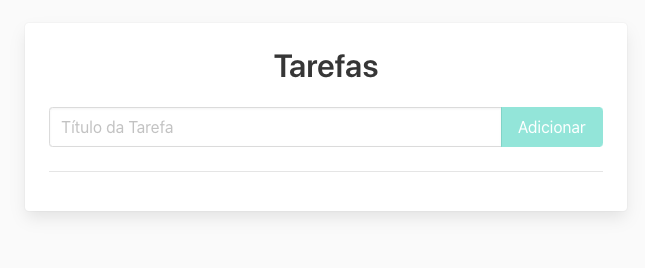

Para garantir que nosso cenário está configurado, vamos começar verificando a versão do Node, que deve ser superior à 14:

`node -v`{{execute}}

E também, já preparamos alguns arquivos de páginas web para testes, vamos também verificar se a pasta `website` existe

`ls`{{execute}}

E se dentro dela

`ls website`{{execute}}

Existe o arquivo "index.html". Esse arquivo é a página web que vamos utilizar como base para a criação e execução dos nossos testes.

---

Mas como vamos acessá-la se é somente um arquivo estático?

Para isso, vamos também subir um simples servidor para acessar o arquivo externamente:

`docker run --name meu-website -v /root/website:/usr/share/nginx/html:ro -d -p 80:80 nginx:alpine`{{execute}}

E deve então estar disponível na porta 80 através da URL:

https://[[HOST_SUBDOMAIN]]-80-[[KATACODA_HOST]].environments.katacoda.com/

E deve se parecer com:

