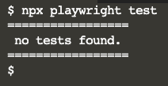

Com as dependências instaladas, vamos agora criar a estrutura de pastas e arquivos necessária para a execução dos testes.

Criando uma pasta para armazená-los

`mkdir tests`{{execute}}


Criando um arquivo vazio para testes e um arquivo para a configuração:

`touch tests/example.spec.ts`{{execute}}

`touch tests/playwright.config.ts`{{execute}}

```sh
cat << EOF > tests/playwright.config.ts
// playwright.config.ts
import { PlaywrightTestConfig, devices } from '@playwright/test';

const config: PlaywrightTestConfig = {
  forbidOnly: !!process.env.CI,
  retries: process.env.CI ? 2 : 0,
  use: {
    trace: 'on-first-retry',
  },
  projects: [
    {
      name: 'chromium',
      use: { ...devices['Desktop Chrome'] },
    }
  ],
};
export default config;
EOF
```
{{execute}}

> Note que na configuração acima, estamos apenas utilizando o navegador Chrome. Também é possível configurar para utilizar o WebKit (Safari) ou o Firefox, quando for necessário garantir a consistência da aplicação nos mais variados ambientes.


E finalmente, podemos executar o comando e rodar os testes:

`npx playwright test --config=tests/playwright.config.ts`{{execute}}

E o resultado deve ser:



Note que o Playwright não identificou nenhum caso de teste, mesmo que os arquivos já tenham sido criados, ainda não codificamos nenhum caso de teste! No próximo passo, vamos implementar nosso primeiro caso.
